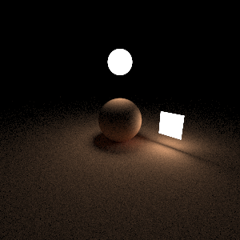
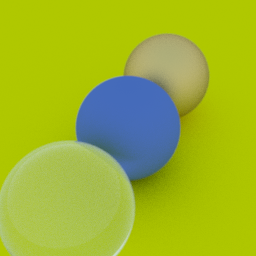
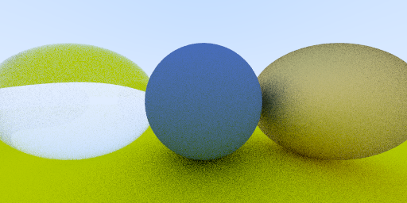

# pictures on CPU by single thread
- uniform sample 1000 spp, 300x300, takes about 123 seconds.   
         
- uniform sample 300 spp, 256x256, takes about 54 seconds    
      
- uiniform 24 spp, 512x256, takes about 6 seconds(seems not correct: down side up, up side donw, sphere becomes not sphere)    
   
  
# CUDA issues
## It takes a long time to init curand state
- It takes 13s to generate a 1024x1024 curand states.
  - breaks down whole kernel into sub-kernel of 256x256 because of big kernel time out.
## Kernel Time out
- Kernel fails if it takes more than 1.6s on my computer.
- Environment  Windows 10
-  CUDA Device
>             Name                                                                GeForce GTX 965M
>             Driver                                                              WDDM
>             DeviceIndex                                                         0
>             GPU Family                                                          GM206-A
>             RmGpuId                                                             256
>             Compute Major                                                       5
>             Compute Minor                                                       2
- WDDM Devices
>                 GPU
>                 Name                                                            GeForce GTX 965M
>                 Architecture                                                    Unknown
>                 Architecture Number                                             288
>                 Architecture Implementation                                     6
>                 Architecture Revision                                           161
>                 Number of GPCs                                                  2
>                 Number of TPCs                                                  8
>                 Number of SMs                                                   8
>                 Warps per SM                                                    64
>                 Lanes per warp                                                  32
>                 Register file size                                              65536
>                 Max CTAs per SM                                                 32
>                 Max size of shared memory per CTA (bytes)                       49152
>                 SM Revision                                                     327680

